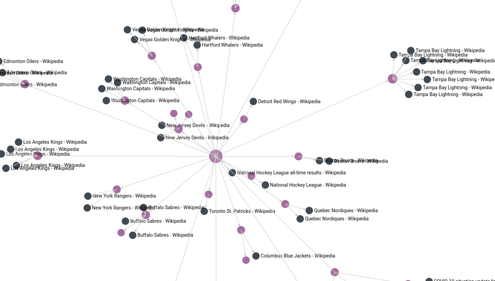
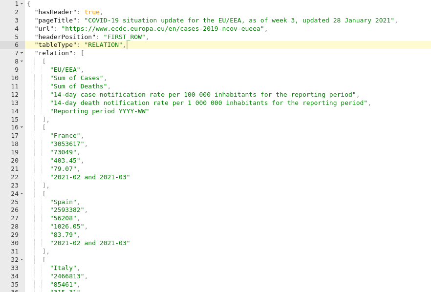

# Introduction

<!-- An introduction to the general topic, current interest etc. -->

The world wide web is full of information. Already the number of web pages indexed by search engines is more than 5 billion [2].
The information on these web pages is mostly aimed at solely human consumption, which at the same time makes it very difficult to be automatically processed by machines.
While plain text data (such as regular HTML websites) are still comprehendible by machines, with complex layouts and designs it becomes increasingly difficult for a machine to access this data in a meaningful way - in the end, we want to turn data into information.

One such example is that of HTML tables. From a human perspective, they are intuitively easy to understand (just by looking at them), but for a machine they are difficult to assess because of their graphical nature: all the little visual details (such as delimiters and orientation) matter a lot.
At the same time, the tables themselves usually just contain the data (e.g. statistics), while the surrounding text (headers, captions and description) gives this data meaning.
For example, the information pair "TSLA, 2007-12-03, 1234" is useless if we do not know that we are dealing with stock prices.

As we will outline in [Section 2](#related-work), there has already been significant academic work in the field of semantic table interpretation.
To develop, compare and optimize these systems however, large datasets are required.
Therefore, the goal of our semester project has been the design and development of a system that collects tables
from HTML on pages on the web.
In [Section 3](#system-requirements-and-design) we give an overview of our system and an explanation of the architectural design choices.
In [Section 4](#implementation-and-milestones), we go into the details of development and showcase the milestones we have reached during the project.
In [Section 5](#results), we summarize the achievements of our work and present the results of our final table collection.
Finally, in [Section 5](#future-work) we provide additional suggestions on how the system should be improved and extended.

# Related work

In this section, we will give an overview of background literature and related work.

The comprehensive survey done by S. Zhang and K. Balog [14] provides an insight into the latest research on table extraction, retrieval and augmentation from the web. The survey paper characterizes this whole process into distinct steps namely table extraction, semantic table interpretation, search, question answering, knowledge base augmentation and table augmentation.

Macdonald and Barbosa have produced one of the most recent public corpora of web tables.
More specifically, their research introduces a publicly available dataset [^macdonald] for benchmarking information extraction from HTML tables.

[^macdonald]: [https://dataverse.library.ualberta.ca/dataset.xhtml?persistentId=doi:10.7939/DVN/SHL1SL](https://dataverse.library.ualberta.ca/dataset.xhtml?persistentId=doi:10.7939/DVN/SHL1SL)

Table extraction is the first step of this whole process. This process of extraction includes filtration of useless tables, proper formatting and consistent storage of tables to create a corpus.
This process includes the classification of tables into one or more semantic (such as subject header, table header) and/or syntactic (such as row and columns) features.
The work by Balakrishnan et. al. [15] used a collection of simple rules and machine learning classifiers to extract tables with an overall accuracy of 96%.

Table interpretation is the act of giving semantic meaning to raw table data.
Among many other steps, this includes determining the data types of columns, the semantic object entities of each column and the relations between columns.

Ritze et al. have developed an algorithm to match HTML tables to DBpedia [7].
The "T2K Match" algorithm is an iterative matching method combining schema and instance matching for matching mostly small and narrow HTML tables against cross-domain knowledge bases.
The source code for this matching system is publicly available [^t2k]
Associating the table cells to semantic entities in knowledge bases greatly helps machines to deal with the logic of tables.

[^t2k]: [https://github.com/T2KFramework/T2K](https://github.com/T2KFramework/T2K)

More recently, Chabot et al. have described a similar system named "DAGOBAH" [8].
DAGOBAH semantically annotates tables with entities either from Wikidata or DBpedia.
It does this by determining the column types as well as performing cell and column annotation and relationship identification.
The system delivered promising results in the "Tabular Data to Knowledge Graph Matching" challenge [8], therefore we will be using it to annotate the tables in our processing pipeline.
Furthermore, we had access to an API of this system in private beta as part of the Orange API [^orangeAPI].

Muñoz et al. tackled the problem of table annotation for `wikitable` class data on Wikipedia [13].
In this research, the table extraction is performed using the _TARTAR_ methodology, which performs table identification, recognition, and parsing.
After extraction, the algorithm attempts to semantically interpret the tables with a raw accuracy of 40%.
Later, a machine learning model utilizing Bagging Decision Trees is used to achieve an accuracy of 81.5% for a portion of the tables.

[^orangeAPI]: [https://developer.orange.com/products/all-apis/](https://developer.orange.com/products/all-apis/)

# System requirements and design

<!-- What we were planning to do (initial goals), an overview of our system and explanation of the design choices. -->

This section gives a high-level overview of the table collection pipeline we have designed and built.
Specific implementation details will be outlined in Section 3.

{ width=70% }

Our pipeline consists of three main components: Scrapy Spiders (CommonCrawl and Web Spider) for downloading web pages, Kafka message queue for buffering extracted tables and ArangoDB database for storing them.
To integrate these individual components, we have developed services to integrate them: an ingestion service for taking items from the message queue, performing annotations and inserting them into the database; and a post-processing service for performing processing on the entire dataset (e.g. creating a graph structure).

We opted for the Python programming language for our implementation because it is very well suited for the task of crawling web pages.
Its flexibility and loose typing make it very convenient to deal with arbitrary and unformatted data.
Finally, it has many excellent open source libraries available.

For the crawling itself, we decided to use the open-source Scrapy application framework [^scrapy]. It not only crawls the webpages using the spiders, but also has built-in support for web-page parsing with parsel [^parsel].
This is in contrast with the libraries such as BeautifulSoup [^beautiful-soup] that only support parsing.

Scrapy provides a well thought-out scaffolding and project structure for each of its main components: spiders (modules for crawling web pages), middlewares (modules for modifying and discarding requests) and items (the pipeline result).
Since all of them are combined into a pipeline by Scrapy's "engine", they are running in parallel and independent from each other.
Furthermore, for each of these components either project-level (download speed, parallel connections etc.) or individual settings (e.g. log verbosity) can be applied.

{ width=80% }

[^scrapy]: [https://scrapy.org/](https://scrapy.org/)
[^parsel]: Parsel is a library to extract individual elements of web pages with XPath or CSS selectors.
[^beautiful-soup]: [https://www.crummy.com/software/BeautifulSoup/](https://www.crummy.com/software/BeautifulSoup/)

Messages queues are extensively used for asynchronous communication. A message queue serves as a buffer, meaning that the crawler is never slowed down by a slow ingestion rate (e.g. due to high load on the database).
Moreover, as the ingestion service (consumer) is not interacting directly with the crawler (producer), it does not become a bottleneck and allows the ingestion service to process items out of the message queue at any speed.
This gives the ingestion service more headroom to perform time consuming tasks, such as augmenting the tables with data obtained from external APIs.

Our preferred choice of message queue was Kafka [^kafka] as it is one of the most popular message queue systems and is extensively used for distributed _event_ streaming services.
Kafka follows a log-committed approach for message bus and hence can also be used as a temporary store of messages for a desirable unit of time.
This is unlike other message queues, such as RabbitMQ [^rabbit-mq], which cannot store any message in case of a database failure.

Since we were using containerized Kafka images, it was also easy to control the topics: their replications and partitions using the environment variables instead of using an admin API.

[^kafka]: https://kafka.apache.org/
[^rabbit-mq]: https://www.rabbitmq.com/

<!-- DONE: What was the motivation for using ArangoDB (while the Kibana stack is generally associated with ElasticSearch)? -->
Finally, we decided to use ArangoDB as our storage backend [^arangodb].
Unlike other NoSQL databases, ArangoDB natively supports multiple data models: document store, graph store and full-text search.
This means it combines the capabilities of databases such as MongoDB, Neo4j and Elasticsearch all into one database [12].
This is excellent for quick prototyping, because it allows us to focus on the data collection and ingestion first, and later we can explore various ways of accessing and analyzing the data.

[^arangodb]: [https://www.arangodb.com](https://www.arangodb.com)

## Monitoring Infrastructure

In addition to the web table harvesting system, we also deployed a parallel monitoring infrastructure for a proper log monitoring and visualization. This infrastructure was based on the popular ELK stack i.e. Elasticsearch, Logstash, and Kibana. ELK stack is a popular platform to analyze and visualize logs from multiple sources in real time.

{ width=70% }

Monitoring infrastructure components:

* Logspout: used for docker logs redirection to logstash.
* LogStash: used for log aggregation
* Elasticsearch: used for indexing and storage
* Kibana: used for analytics and visualization


# Implementation and Milestones

After familiarizing ourselves with the topic and having studied the relevant literature, we began designing and implementing our data processing pipeline.
This section will cover our implementation and the milestones we have completed in the course of our semester project.

## Basic crawling and table extraction

The first significant milestone we reached was the basic crawling of web pages (i.e. downloading the HTML contents) and extracting the HTML tables.
At this stage, our tool would simply take a list of URLs, download and parse these pages and finally store the results in a JSON file.
Parsing is performed using the Scrapy framework, which includes a variety of methods that enable element selection from the crawled documents.
To extract values from the table elements, we needed to extract the relevant content from within the cells.
For this task, we used the Beautiful Soup python library.

<!-- DONE: What library, if any, did you use to actually perform the table extraction (or was it coded from scratch)? Does Scrapy only manage the crawling part?  -->

## Advanced table parsing

The next big step was implementing advanced table extraction and parsing algorithms.
In particular, we decided to use two different algorithms for parsing tables on Wikipedia pages and the rest of the web pages.
The decision between extractors is made on a domain basis.
This allows mode granular control over the parsed tables, as domains tend to follow certain formats for the data they display.
Specifically, we parsed the semi-structured `wikitable` structures using techniques introduced in a related research paper [13].
This structure for the parsers enables expanding the implementation for auxiliary domains, for a finer-grained control of certain edge-cases.

Based on the literature we studied previously, we identified and implemented several important criteria which allow us to collect tables with meaningful content:

* ignore layout tables (table used for designing the webpage)
* ignore tables irregular bodies (number of rows and columns varies)
* ignore small tables (table with less than two rows)

As mentioned in the introduction, the value of information inside a table is not only embedded in the table itself, but also in the context.
Thus, we wanted to collect as much contextual information as possible.
To this end, we also implemented algorithms to extract the following information from the web page:

* Page title
* Table title
* Paragraph before/after the table
* Most frequent terms
* Language of the page

To make sure our algorithms work correctly and we don't accidentally introduce any regressions, we also added unit and integration tests for our code.
The unit tests are testing small pieces of separate functionality (such as text extraction, cleaning and normalization), while the integration tests make sure that when we input a particular HTML page into our pipeline, we always obtain the same parsed result on the other end.

## Data format

<!-- DONE: What was the design decision for the JSON metadata format for representing the table metadata and content? Clearly, you have been influenced by the WDC format, http://webdatacommons.org/webtables/2015/downloadInstructions.html ... what else?  -->

By now, we were collecting many different pieces of information and had to come up with a data format to store this data in.
We evaluated several data formats that have already been used in other projects.
Initially, we also considered using a storage format suitable for very large datasets, in particular Apache Avro, but decided against it due to the difficulty of dealing with binary formats.
Furthermore, since we were planning to build a pipeline for table collection, an easily serializable plaintext format seemed more suitable for our purposes.
Despite these requirements, we still had several contenders:

* TableNet (JSON based) [3]
* DWTC Dresden Web Table Corpus (JSON based) [4]
* WTC Web Table Corpora (JSON based) [5]
* W3C CSV [6]

After comparing these options, we decided that the W3C CSV format is not suitable, because information about a single table is stored in multiple CSV files (one file for the table content, additional files for the metadata).
This would increase the complexity of our data pipeline significantly.

Since the WTC format is based on the DWTC format, the DWTC seemed to be a widely used and proven data format.
We also considered the attributes it contained relevant to our use case, but at the same time decided to extend it with additional metadata and also incorporate some fields from the TableNet format.
We hope that this common choice will enable others to easily reuse parts of our pipeline or the data.

To document our final data format and make sure our application adheres to it, we created a JSON schema definition ([Appendix A](#a.-json-schema-definition)).

## Common Crawl

In addition to crawling pages from the world wide web, we also wanted to explore using the Common Crawl dataset [1]. Common Crawl is a free corpus of web pages that had been consolidated over 12 years of continuous web crawling.
The public dataset is currently hosted on Amazon S3 [^amazon-s3] through Amazon's public dataset program. This dataset gets updated once every month with raw web pages along with processed metadata and extracted text.

To perform crawling over Common Crawl, we created a second separate spider that can search, retrieve and process webpages and forward them into our larger ingestion pipeline.
Common Crawl saves data in Web ARChive (WARC) format. To fetch any webpage from the common crawl, we first need to query the URL in the Common Crawl index server which returns the WARC URL of the page in an S3 bucket.
To perform this search process, our common crawl spider uses the cdx-toolkit [^cdx-toolkit] library. This library not only performs query searching on the index, but it also has the support to fetch and handle the WARC files.

Downloading any archived webpage from the Common Crawl is a two step process. It involves first querying the index for the given input URL and then downloading and processing the WARC file. To handle this, the input URL provided to Scrapy is intercepted in middleware's `process_request` method.
The intercepted request is redirected to `CommonCrawlSearch` which searches the Common Crawl search index for a recent snapshot of the webpage.
Additionally, this class also has methods to download the WARC file and process it to return the extracted HTML. The returned HTML can then be parsed and ingested through the same web crawl pipeline.

[^amazon-s3]: https://aws.amazon.com/s3/
[^common-crawl]: https://commoncrawl.org
[^cdx-toolkit]: https://github.com/cocrawler/cdx_toolkit

## First crawl

Approximately three months after the start of the project, we conducted a first, short test run of our table collection pipeline.
This was to make sure the components we had developed and integrated so far all worked correctly and could sustain operating for a prolonged period of time.
During the 8 hours run, we collected 22.000 tables from 5156 webpages on 153 unique domains.

```
db._query(`RETURN LENGTH(parsed_tables)`).toArray()[0];
> 22909

db._query(`FOR t in parsed_tables RETURN t.url`).toArray()\
  .filter((v, i, a) => a.indexOf(v) === i).length;
> 5156

db._query(`FOR t in parsed_tables RETURN t.url`).toArray()\
  .map(function(url) { return url.split("/")[2]; })\
  .filter((v, i, a) => a.indexOf(v) === i).length;
> 153
```

An in-depth look at the collected data revealed that our pipeline worked as intended.
The spider component downloaded web pages and extracted tables from them.
Occasionally, there were errors as websites were not reachable anymore (dead links).
The extracted table items were sent through the message queue and inserted into the database by our ingestion service.

This initial crawl was seeded with just a handful of URLs and therefore the content of the visited pages was heavily skewed towards certain topics.
This was not an issue however, since meaningful data collection was not an explicit goal of our first test.

## Crawling strategy

After analyzing the results from our first crawl, we had to define a sensible crawling strategy.
After the spider downloads a webpage, it extracts all hyperlinks (inside HTML `<a>` tags) from it and generates new requests for these links.

Firstly, we enabled a Scrapy plugin that prevents crawling previously visited pages [^crawl-once].
Such a feature is necessary because it is common for links in the header and footer of webpages to be same across an entire domain (e.g. Privacy Policy and About pages)
This plugin keeps a sqlite database with all URLs that have been downloaded by the spider.

For the crawling strategy itself, we came up with a two tier approach for selecting which domains should be crawled.
We define a list of whitelisted domains.
Webpages on these domains will always be crawled.
Furthermore, the crawler will follow all links on these webpages.
Once the crawler arrives on a webpage that is not in the whitelist, it still crawls that particular webpage, but does not follow any links on it.

For creating the domain whitelist, we manually composed a list of domains most relevant to our usecase (HTML table extraction from webpages) based on three sources: Alexa Top 500 ranking [^alexa], Moz Top 500 [^moz] and CommonCrawl Top 1000 domains ranked by harmonic centrality [^cc-domains].
Our selection focused on domains with high-quality, English language content.
The full list of whitelisted domains is available in [Appendix B](#b.-list-of-whitelisted-domains).

Additionally, we also created a domain blacklist.
One example that demonstrates the necessity of this is the mobile pages of Wikipedia, which are available under a different domain (en.m.wikipedia.org instead of en.wikipedia.org), but still contain the same content.
Similarly, we decided to exclude non-english wikipedias, since we wanted to focus on english content.
The full list of blacklisted domains is available in [Appendix C](#c.-list-of-blacklisted-domains).

Finally, we also gathered a list of seed URLs.
These URLs are given to the spider when it starts crawling and serve as an entrypoint to the vast world wide web.
From there on the spider will automatically crawl linked pages, as described before.
Therefore, the topic of the initial seed URLs will influence the direction of the entire crawl.
The chosen list of seed URLs is shown in [Appendix D](#d.-list-of-seed-urls).

[^crawl-once]: [https://github.com/TeamHG-Memex/scrapy-crawl-once](https://github.com/TeamHG-Memex/scrapy-crawl-once)
[^alexa]: [https://www.alexa.com/topsites](https://www.alexa.com/topsites)
[^moz]: [https://moz.com/top500](https://moz.com/top500)
[^cc-domains]: [https://commoncrawl.org/2020/10/host-and-domain-level-web-graphs-julaugsep-2020/](https://commoncrawl.org/2020/10/host-and-domain-level-web-graphs-julaugsep-2020/)

## Visualization

<!-- Describe visualization and exploration in the arangodb dashboard. -->

With these first results, we started exploring the graph capabilities of the ArangoDB backend.
Until now we used the database only as a simple document store.

In ArangoDB, documents stored in a regular *collection* ("database table") act as *vertices* ("nodes").
In order to leverage the graph capabilities, we need to insert additional documents into *edge collection*.
An edge document has at least two keys: `_from` and `_to`, which describe a directed edge from one vertex to another.
The value of these keys are the IDs of the vertex documents.

The following figure is such a vertex document.
The `_id`, `_key` and `_rev` fields are database internals.
Additionally, in this example we used a `type` key to distinguish different types of edges.

```
{
  "_id"   : "htw_edges/40320",
  "_key"  : "40320",
  "_rev"  : "_btUZfLu---",
  "_from" : "visited_pages/40317",
  "_to"   : "parsed_tables/8787",
  "type"  : "page-contains"
}
```

In a post-processing step we establish the edges between all the relevant documents (tables and pages) we have previously collected.
Then, we can explore this graph programmatically with the Arango Query Language (AQL) or visually through the Arango Dashboard.


In Figure 4, the violet circles represent page vertices (a webpage that has been accessed), while the black vertices represent table vertices (a table that has been extracted).
The virtual start node is "HTW Start" (where the crawl started), but the start node can be adjusted through the UI to start traversing the graph.
Alongside the edges the edge type is displayed, in this example either "hyperlink" (one webpage links to another webpage) or "page-contains" (a table is embedded on a webpage).
The search depth and the maximum number of nodes displayed in the graph can be dynamically adjusted in the UI to facilitate the exploration, though loading large graphs at all once breaks the visualization and has performance issues.

## Table processing & Topic annotation

We planned to use the previously mentioned Orange API [^orangeAPI] to annotate the tables we have collected.
This means performing further post-processing steps, using the collected items as inputs, to enhance and extend the table items.
In particular, we were interested in using a topic classifier to identify the logical topic of a table or website.
This was the reason we included additional metadata such as "termSet" in our data format.
Then, we could draw a similar graph to the one shown in the previous section, but instead of using "visited websites" as nodes, we could use "topic" as a node linking several tables together - potentially from many different websites.

Unfortunately, the annotation API was not made available to us on time.
The preprocessing API, which would have allowed us to classify the orientation, layout etc. of the tables was still in beta.
It frequently returned errors and exhibited other discrepancies.
Thus, the full API integration will be left as future work.

# Results

<!-- What we managed to do and why/how it could be useful (and what we didn't achieve and why). -->

We managed to build a web scraping and table processing pipeline from the ground up, utilizing basic components such as the Scrapy framework, Kafka message queue and ArangoDB document store.
This pipeline can ingest data not only from the world wide web directly, but also through the Common Crawl index.
We implemented advanced table parsing and specified a JSON data format for storing the tables, taking into account work that has previously been done in the field.
While implementing our pipeline, we tried to keep the system modular and extensible, so that it can readily be reused by others.



During the last week of January, we performed a final table collection with our pipeline.
We collected 3469 tables from 2002 websites on 135 unique domains.
Considering the amount of time, the collected number of tables is quite low.
This is due to the constrained set of domains in our whitelist ([Appendix B](#b.-list-of-whitelisted-domains)) and also our limited number of seed URLs with selected topics ([Appendix D](#d.-list-of-seed-urls)).




# Future work

<!-- How the work we have done so far can be continued or improved. -->

For future work, the first would be measuring the current performance of the system.
For this task, a dataset, such as the one released by Macdonald and Barbosa, could be used to measure the extraction and detection accuracy of the system.
However, this would first require a data format compatibility study.

Once these level of system performance has been captured, the table filtering and extraction algorithms implemented so far can be improved upon.
In particular, the works from Ritze et al. [7] as well as Eberius et al. [11] should serve as an excellent starting point for these optimizations.

The pipeline allows a granular control of table extraction, but for the extracted data to be useful it should go through an annotation procedure, where the simple raw data is transformed into a meaningful format.
As described in the implementation section, this is left as future work.
Specifically, using the Dagobah API from Orange could provide useful data once there is a stable release available.

<!-- DONE: When you go over a page that has been previously crawled, do you have mechanism to detect changes on the page or not?  -->

Furthermore, the crawling strategy used for downloading pages from the world wide web should be tweaked. While a basic mechanism to avoid crawling the same URL multiple times has been implemented, websites have become very complex today and often host the same content on multiple distinct URLs. The knowledge that has been gained through the search engines (and search engine optimization) in the last 15 years should be drawn upon to explore the web of pages on the internet.

At the same time, another interesting avenue for research is purposely re-visiting pages that have been crawled before, to check for updates made to those pages.

Finally, in 2021 we are beginning to see a necessity for more advanced extraction techniques that support client-side rendering of webpages.
At the moment, most websites containing tabular data are still rendered server-side (meaning the webserver generates the HTML and sends the finished result to the client).
However, there is an increasing number of websites, like [Our World In Data](https://ourworldindata.org/), that use client-side rendering and single page application frameworks (SPA), where the HTML content is generated on the client with JavaScript.
In such cases, a headless browser environment is required which dramatically increases the compute resource requirements of the crawler.

\clearpage

# References {.unnumbered}

[1] Common Crawl Foundation: *"Common Crawl corpus"*, [https://commoncrawl.org/the-data/get-started/](https://commoncrawl.org/the-data/get-started/).

[2] M. de Kunder: *"The size of the World Wide Web (The Internet)"*, [https://www.worldwidewebsize.com/](https://www.worldwidewebsize.com/) (retrieved 2021-01-13).

[3] B. Fetahu, A. Anand, M. Koutraki:
*"TableNet: An Approach for Determining Fine-grained Relations for Wikipedia Tables"*, Proceedings of the 2019 World Wide Web Conference on World Wide Web (2019).

[4] J. Eberius, M. Thiele, K. Braunschweig, W. Lehner: *"Top-k Entity Augmentation Using Consistent Set Covering"*, SSDBM [https://wwwdb.inf.tu-dresden.de/misc/dwtc/](https://wwwdb.inf.tu-dresden.de/misc/dwtc/) (2015).

[5] O. Lehmberg, D. Ritze, R. Meusel, C. Bizer: *"A Large Public Corpus of Web Tables containing Time and Context Metadata"*, WWW 2016. [http://webdatacommons.org/webtables/](http://webdatacommons.org/webtables/).

[6] W3C CSV Working Group: *"CSV on the Web: A Primer"*, [https://www.w3.org/TR/tabular-data-primer/](https://www.w3.org/TR/tabular-data-primer/) (2016).

[7] D. Ritze, O. Lehmberg, C. Bizer: *"Matching HTML Tables to DBpedia"*, Proceedings of the 5th International Conference on Web Intelligence, Mining and Semantics (2015).

[8] Y. Chabot, T. Labb, J. Liu, R. Troncy:*"DAGOBAH: An End-to-End Context-Free Tabular Data Semantic Annotation System"*, SemTab 2020.

[9] Semantic Web Challenge on Tabular Data to Knowledge Graph Matching 2020, [http://ceur-ws.org/Vol-2775/](http://ceur-ws.org/Vol-2775/).

[10] E. Macdonald, D. Barbosa: *"An Annotated Corpus of Webtables for Information Extraction Tasks"*, [https://doi.org/10.7939/DVN/SHL1SL](https://doi.org/10.7939/DVN/SHL1SL), UAL Dataverse, V2 (2019).

[11] J. Eberius, K. Braunschweig, M. Hentsch, M. Thiele, A. Ahmadov and W. Lehner: *"Building the Dresden Web Table Corpus: A Classification Approach"*, IEEE/ACM 2nd International Symposium on Big Data Computing (2015).

[12] ArangoDB Inc.: *"What is a Multi-model Database and Why Use It?"*, [https://www.arangodb.com/resources/white-paper/multi-model-database/](https://www.arangodb.com/resources/white-paper/multi-model-database/) (2020).

[13] E. Muñoz, A. Hogan, A. Mileo: *"Using linked data to mine RDF from wikipedia's tables"* WSDM (2014).

[14] S. Zhang, K. Balog: *"Web Table Extraction, Retrieval, and Augmentation: A Survey"* ACM Transactions on Intelligent Systems and Technologies (2020).

[15] S. Balakrishnan, A. Halevy, B. Harb, H. Lee, J. Madhavan, A. Rostamizadeh, W. Shen, K. Wilder, F. Wu, C. Yu: *"Applying WebTables in Practice"* Conference on Innovative Data Systems Research (2015).


\clearpage

# Appendices {.unnumbered}

## A. JSON schema definition {.unnumbered}

\lstinputlisting[basicstyle=\scriptsize\ttfamily]{../data/schema.json}

## B. List of whitelisted domains {.unnumbered}

The domain itself as well as all subdomains are whitelisted.

```
android.com
apache.org
bbc.co.uk
blogspot.com
creativecommons.org
doi.org
en.wikipedia.org
europe.eu
gamepedia.com
github.com
github.io
iana.org
imdb.com
medium.com
merriam-webster.com
microsoft.com
mozilla.org
nasa.gov
nih.gov
noaa.gov
schema.org
statista.com
w.org
wikibooks.org
wikimedia.org
wikiquote.org
wordpress.com
wordpress.org
```

## C. List of blacklisted domains {.unnumbered}

Python Regular Expressions

```python
[
    # blacklist everything except en.wikipedia.org:
    r'^(?!.*(en)).*\.wikipedia\.org',
    # blacklist everything except english wikis:
    r'^(?!.*(en)).*\.wiki.*\.org',
    # blacklist mobile pages:
    r'^.*\.m\..*',
]
```

## D. List of Seed URLs {.unnumbered}

\lstinputlisting{../data/seed-urls.txt}
