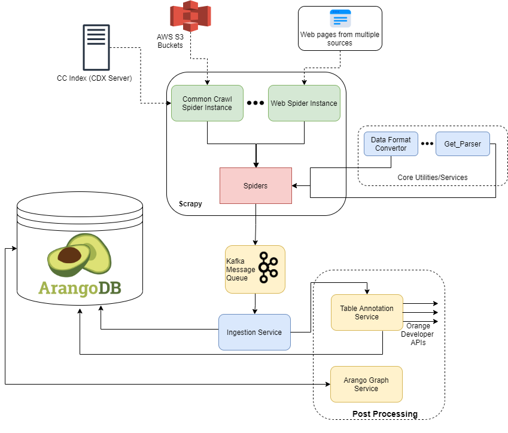

<!-- New page after table of contents -->
\clearpage

# Introduction

<!-- An introduction to the general topic, current interest etc. -->

The world wide web is full of information. Already the number of web pages indexed by search engines is more than 5 billion [2].
The information on these web pages is mostly aimed at solely human consumption, which at the same time makes it very difficult to be automatically processed by machines.
While plain text data (such as regular HTML websites) are still comprehendible by machines, with complex layouts and designs it becomes increasingly difficult for a machine to access this data in a meaningful way - in the end, we want to turn data into information.

One such example are HTML tables. From human perspective they are intuitively easy to understand (just by looking at them), but for a machine they are difficult to assess because of the graphical nature of them: all the little visual details (such as delimiters and orientation) matter a lot.
At the same time, the tables themselves usually just contain the data (e.g. statistics), while the surrounding text (headers, captions and description) gives this data meaning.
For example, the information pair "TSLA, 2007-12-03, 1234" is useless if we do not know what we are dealing with stock prices.

As we will outline in Section 2, there has already been significant academic work in the field of semantic table interpretation.
To develop, compare and optimize these systems however, large datasets are required.
Therefore, the goal of our semester project has been the design and development of a system that collects tables
from HTML on pages on the web.
In Section 3 we detail the development and design choices of this system.
...
Finally, in Section 5 we provide additional suggestions on how the system should be improved and extended.

# Related work

In this section we will give an overview of background literature and related work.

**TODO** *Give a brief overview of the papers we have studied, especially the ones from the literature review presentation*

## Datasets

## Semantic Table Interpretation


# System requirements and design

<!-- What we were planning to do (initial goals), an overview of our system and explanation of the design choices. -->

This section gives a high-level overview of the table collection pipeline we have designed and built.
Specific implementation details will be outlined in Section 3.




Language Used: Python 3

System Design:

* Scrapy
* Kafka Message Queue
* ArangoDB Database

Service Components:

* Scrapy Spiders such as Common crawl Spider and web spider
* Ingestion Service
* PostProcessing services such as table annotation service


<!-- Motivation for Scrapy -->
#### Motivation for different design elements used.
__Scrapy__
Scrapy is an application framework for web scraping implemented in Python. It not only crawls the webpages using the spiders, but also has built-in support for web-page parsing with parsel [^parsel].
This is in contrast with the libraries such as BeautifulSoup [^beautiful-soup] that only support parsing.

The other big motivation behind selecting scrapy was the fine-grained support for customizable scrapy settings. It not only project level setting,but also independent setting per spider. 
This essentially means management/life-cycle, integration with middlewares etc could be controlled independently. 
Use of libraries such as kafka-python [^kafka-python] ensured a easier integration with the message queue.

[^parsel]: Parsel is a library to extract individual elements of web pages with XPath or CSS selectors.
[^beautiful-soup]: https://www.crummy.com/software/BeautifulSoup/
[^kafka-python]: https://github.com/dfdeshom/scrapy-kafka 


__Kafka__:
Messages queues are extensively used for asynchronous communication. A message queue serves as a buffer, meaning that the crawler is never slowed down by a slow ingestion rate (e.g. due to high load on the database).
Moreover, as the ingestion service is not interacting directly with the producer (crawler), it does not become a bottleneck and allows the ingestion service to process items out of the message queue at any speed. 
This gives the ingestion service more headroom to perform time consuming tasks, such as augmenting the tables with data obtained from external APIs.

Our preferred choice of message queue was Kafka [^kafka] as it is one of the most popular message queue systems and is extensively used for distributed _event_ streaming services. 
Kafka follows a log-commited approach for message bus and hence can also be used as a temporary store of messages for a desirable unit of time.
This is unlike other message queue such as RabbitMQ [^rabbit-mq] that cannot store any message in case of a database failure.

Since we were using containerized Kafka images, it was also easy to control the topics, replication of topics and partitions using the environment variables instead of using an admin API.

[^kafka]: https://kafka.apache.org/
[^rabbit-mq]: https://www.rabbitmq.com/
<!-- DONE: What was the motivation for using ArangoDB (while the Kibana stack is generally associated with ElasticSearch)? -->
__ArangoDb__:
Finally, we decided use ArangoDB as our storage backend. 
Unlike other NoSQL databases, ArangoDB natively supports multiple data models: document store, graph store and full-text search.
This means it combines the capabilities of databases such as MongoDB, Neo4j and Elasticsearch all into one database.
This is excellent for quick prototyping, because it allows us to focus on the data collection and ingestion first, and later we can explore various ways of accessing and analyzing the data. https://www.arangodb.com/resources/white-paper/multi-model-database/

## Monitoring Infrastructure
In addition to the web table harvesting system, we also deployed a parallel monitoring infrastructure for a proper log monitoring and visualization. This infrastructure was based on the popular ELK stack i.e. Elasticsearch, Logstash, and Kibana. ELK stack is completely open-source, popular and can analyze and visualize logs from multiple sources in real time.


Monitoring infrastructure components:
* Logspout: used for docker logs redirection to logstash.
* LogStash: used for log aggregation
* Elasticsearch: used for indexing and storage
* Kibana: used for analytics and visualization


# Implementation and Milestones

After familiarizing ourselves with the topic and having studied the relevant literature, we began designing and implementing our data processing pipeline.
This section will cover our implementation and the milestones we have completed in the course of our semester project.

## Basic crawling and table extraction

The first significant milestone we reached was the basic crawling of web pages (i.e. downloading the HTML contents) and extracting the HTML tables.
At this stage, our tool would simply take a list of URLs, download and parse these pages and finally store the results in a JSON file.

We opted for the Python programming language for our implementation because it very well suited for the task of crawling web pages, its flexibility and loose typing make it very convenient to deal with arbitrary and unformatted data and finally it has many excellent open source libraries available.
For the crawling itself, we decided to use the Scrapy framework \cite{scrapy} **TODO** *why?*

<!-- TODO: What library, if any, did you use to actually perform the table extraction (or was it coded from scratch)? Does Scrapy only manage the crawling part?  -->

## Advanced table parsing

The next big step was implementing advanced table extraction and parsing algorithms.
In particular, we decided to use two different algorithms for parsing tables on Wikipedia pages and the rest of the web pages.
This decision was made because Wikipedia pages follow a much stricter format than the average table on the web.
**TODO** @eelisk *Expand on the Wikipedia algorithm*

Based on the literature we studied previously, we identified and implemented several important criteria which allow us to collect tables with meaningful content:

* ignore layout tables (table used for designing the webpage)
* ignore tables irregular bodies (number of rows and columns varies)
* ignore small tables (table with less than two rows)

As mentioned in the introduction, the value of information inside a table is not only embedded in the table itself, but also in the context.
Thus, we wanted to collect as much contextual information as possible.
To this end, we also implemented algorithms the extract the following information from the web page:

* Page title
* Table title
* Paragraph before / after the table
* Most frequent terms
* Language of the page

To make sure our algorithms work correctly and we don't accidentally introduce any regressions, we also added unit and integration tests for our code.
The unit tests are testing small pieces of separate functionality (such as text extraction, cleaning and normalization), while the integration tests make sure that when we input a particular HTML page into our pipeline, we always obtain the same parsed result on the other end.

## Data format

<!-- DONE: What was the design decision for the JSON metadata format for representing the table metadata and content? Clearly, you have been influenced by the WDC format, http://webdatacommons.org/webtables/2015/downloadInstructions.html ... what else?  -->

By now, we were collecting many different pieces of information and had to come up with data format to store this data in.
We evaluated several data formats that have already been used in other projects.
Initially, we also considered using a storage format suitable for very large datasets, in particular Apache Avro, but decided against due to the difficulty of dealing with binary formats.
Furthermore, since we were planning to build a pipeline for table collection, a plaintext format that is easily serializable seemed more suitable for our purposes.
Despite these requirements, we still had several contenders:

* TableNet (JSON based) [3]
* DWTC Dresden Web Table Corpus (JSON based) [4]
* WTC Web Table Corpora (JSON based) [5]
* W3C CSV [6]

After comparing these options, we decided that the W3C CSV format is not suitable, because information about a single table is stored in multiple CSV files (one file for the table content, additional files for the metadata).
This would increase the complexity of our data pipeline significantly.

Since the WTC format is based on the DWTC format, the DWTC seemed to be a widely used and proven data format.
We also considered the attributes it contained relevant to our use case, but at the same time decided to extend it with additional metadata and also incorporate some fields from the TableNet format.

To document our final data format and make sure our own application adheres to it, we created a JSON schema definition (Appendix ABC).

## Common Crawl

In addition to crawling pages from the world wide web, we also wanted to explore using the CommonCrawl dataset \cite{}.
**TODO** @rohitshubham *Explain what the CC is and how we use it*

## First crawl

<!-- TODO: When you go over a page which has been previously crawled, do you have mechanism to detect changes on the page or not?  -->

## Crawling strategy

After analyzing the results from our first crawl, we had to (d/r)efine our crawling strategy.

*TBD*

## Visualization

<!-- Describe visualization and exploration in the arangodb dashboard. -->

With these first results, we started the exploring the graph capabilities of the ArangoDB backend.
Until now we used the database only as a simple document store.

In ArangoDB, documents stored in a regular *collection* ("database table") act as *vertices* ("nodes").
In order to leverage the graph capabilities, we need insert additional documents into *edge collection*.
An edge document has at least two keys: `_from` and `_to`, which describe a directed edge from one vertex to another.
The value of these keys are the IDs of the vertex documents.

The following figure is an such a vertex document.
The `_id`, `_key` and `_rev` fields are database internals.
Additionally, in this example we used a `type` key to distinguish different types of edges.


```
{
  "_id"   : "htw_edges/40320",
  "_key"  : "40320",
  "_rev"  : "_btUZfLu---",
  "_from" : "visited_pages/40317",
  "_to"   : "parsed_tables/8787",
  "type"  : "page-contains"
}
```

In a post-processing step we establish the edges between all the relevant documents (tables and pages) we have previously collected.
Then, we can explore this graph programmatically with the Arango Query Language (AQL) or visually through the Arango Dashboard.


In Figure 1, the violet circles represent page vertices (a webpage that has been crawled), while the black vertices represent table vertices (a table that has been collected).
The virtual start node is "HTW Start" (where the crawl started), but this can adjusted through the UI to start traversing the graph.
Alongside the edges the edge type is displayed, in this example either "hyperlink" (one webpage links to another webpage) or "page-contains" (a table is embedded on a webpage).
The search depth and maximum number of nodes displayed in the graph can be dynamically adjusted in the UI to facilitate the exploration, though loading large graphs at all once breaks the visualization and has performance issues.

**TODO** *Once we have the table topics, do the same thing for them*

## Topic annotation

(*TBD*) with Orange API.

# Results

What we managed to do and why/how it could be useful (and what we didn't achieve and why).

# Future work

How the work we have done so far can be continued or improved.

* Improve table filtering and extraction algorithm
* Improve crawling strategy

\clearpage

# References

[1] Hassan, Md Imrul, Hai L. Vu, and Taka Sakurai. *"Performance analysis of the IEEE 802.11 MAC protocol for DSRC safety applications."* IEEE Transactions on vehicular technology 60.8 (2011): 3882-3896.

[2] https://www.worldwidewebsize.com/

[3] https://github.com/bfetahu/wiki_tables/tree/master/data

[4] https://wwwdb.inf.tu-dresden.de/misc/dwtc/schema.json

[5] http://webdatacommons.org/webtables/#results-2015

[6] https://www.w3.org/TR/tabular-data-primer/

# Appendices

## JSON schema definition

\lstinputlisting[basicstyle=\scriptsize\ttfamily]{../data/schema.json}
